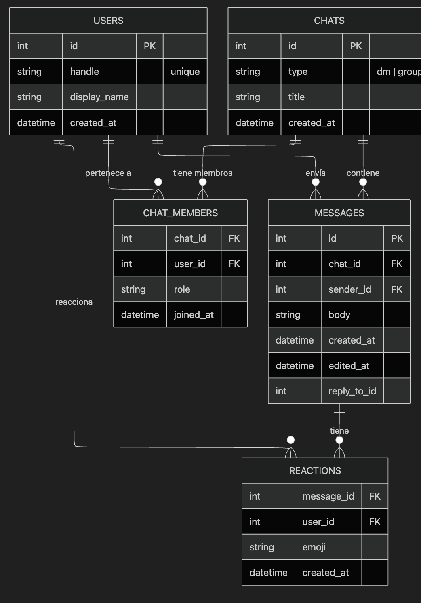
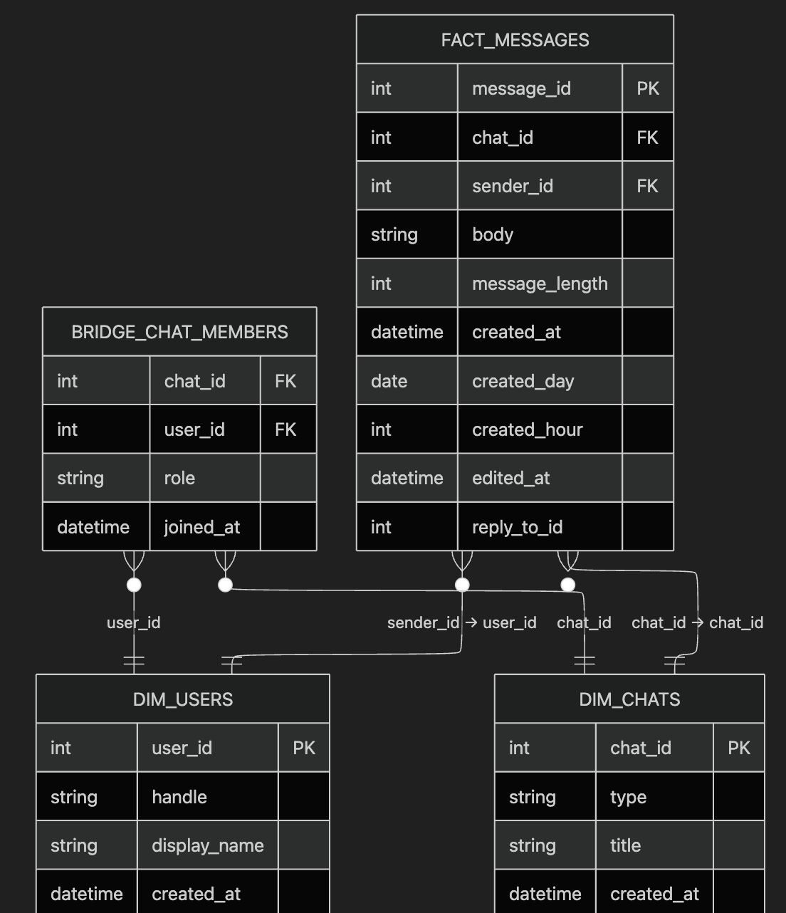

# Rxul Chat & ETL

**English** · [Español](#readme-es)

A **full-stack** reference implementation: real-time messaging API, React web app, **Temporal-orchestrated ETL** into a PostgreSQL **data warehouse**, optional **Apache Spark** jobs, **Metabase** BI, and a full **observability** stack (Prometheus, Grafana, Loki). CI/CD and Terraform (DigitalOcean) are included for operators who want a production-like path.

---

## English

### Overview

| Layer | Technology | Role |
|-------|------------|------|
| API | FastAPI, SQLAlchemy, Uvicorn | Users, chats, messages, reactions, bookings, ETL trigger endpoints |
| Real-time | WebSockets | Live messaging per chat room |
| Frontend | React 18, TypeScript, Vite, Zustand | Web client (auth, chat UI) |
| OLTP | PostgreSQL (`messaging`) | Application state |
| ETL orchestration | **Temporal** (workflows + dedicated worker) | Durable runs, retries, parallelism, backfills |
| Analytics / DW | PostgreSQL (`warehouse`) | Dimensional model, incremental watermarks |
| Batch analytics | Apache Spark (master / worker) | Heavy reads / aggregates from the DW (`spark/apps/`) |
| BI | Metabase | Explore and dashboard the warehouse |
| Observability | Prometheus, Grafana, Loki, Promtail, exporters | Metrics, logs, pre-provisioned dashboards |

The transactional path (API + OLTP) is separated from the analytical path (API → transform → warehouse), with enterprise-style orchestration via Temporal.

### Architecture





Locally, `docker-compose.yml` starts **many coordinated services** (multiple Postgres instances, Temporal, ETL worker, Spark, Metabase, full observability stack). Treat this as an **integrated environment**, not a single-container demo.

### Scalability notes

- **Stateless API**: scale FastAPI horizontally behind a load balancer for REST; WebSocket fan-out across instances typically needs a **pub/sub broker** (e.g. Redis) — the current `ConnectionManager` is in-process.
- **OLTP vs DW**: analytical load stays off the primary app database.
- **Temporal**: `EtlWorkflow`, `EtlIncrementalWorkflow`, and `BackfillMessagesWorkflow` use configurable parallelism, per-activity timeouts, and retry policies; work is batched **per chat** to limit workflow history size.
- **Workers**: scale `etl-worker` replicas (`docker compose up -d --scale etl-worker=3`) against the same Temporal task queue.
- **Incremental loads**: `etl_watermarks` in the warehouse supports repeatable incremental sync.
- **Cloud**: `terraform/digitalocean/` splits droplets (app vs data vs monitoring) so you can size Spark/Temporal independently.

### What this repository contains

1. REST API and OpenAPI docs (`/docs`).
2. WebSocket chat channel with membership checks.
3. Prometheus metrics at `/metrics` (`prometheus-fastapi-instrumentator`).
4. Standalone batch ETL script: `etl/run_etl.py` (idempotent DDL + upserts).
5. Temporal-based ETL: `app/temporal/` (extract from paginated API, transform, load facts: messages, reactions, bookings, booking events).
6. Warehouse schema: `etl/ddl.sql` (`dim_*`, `fact_*`, indexes).
7. Frontend in `frontend/` with Vitest; optional product analytics dependency (Amplitude) — configure keys only if you use it.
8. Backend tests under `tests/` (pytest).
9. GitHub Actions for CI/CD; see `.github/workflows/`.
10. Grafana dashboards, Loki/Promtail, Postgres and node exporters.

More docs: `README_IMPLEMENTACION.md`, `etl/README_ETL.md`, `OBSERVABILIDAD.md`, `DEPLOYMENT_DIGITALOCEAN.md`.

### Prerequisites

- **Docker** and **Docker Compose v2** (recommended path).
- Optional: **Python 3.12+** and **Node 20+** for local development without Docker.

### Clone and first-time setup

```bash
git clone https://github.com/<your-org-or-user>/ETL.git
cd ETL
```

Create a **`.env` file in the repository root** (Docker Compose loads it). Do **not** commit real secrets. Example template — **replace all passwords**:

```bash
# --- Operational DB (service name: db, database: messaging) ---
DB_PASSWORD=change-me-db
DATABASE_URL=postgresql+psycopg2://postgres:change-me-db@db:5432/messaging

# --- Data warehouse (service name: dw, database: warehouse) ---
DW_PASSWORD=change-me-dw
WAREHOUSE_URL=postgresql://postgres:change-me-dw@dw:5432/warehouse

# --- Temporal (defaults match docker-compose service names) ---
TEMPORAL_TARGET=temporal:7233
TEMPORAL_NAMESPACE=default

# URL the ETL worker uses to call the API (inside Compose network)
API_BASE_URL=http://api:8000

# --- Metabase internal DB ---
METABASE_DB_PASSWORD=change-me-metabase-db

# --- Grafana ---
GRAFANA_ADMIN_PASSWORD=change-me-grafana

# --- CORS (comma-separated origins for your browser dev server / prod domain) ---
CORS_ORIGINS=http://127.0.0.1:5173,http://localhost:5173
```

**Important for public forks**

- The repo may contain **example defaults in source** (e.g. `app/database.py` fallbacks). Always override with **`DATABASE_URL` / `WAREHOUSE_URL` in `.env`** and never commit production credentials.
- `frontend/vite.config.ts` and `frontend/src/config/api.ts` may point at a **sample host** for development. For your machine, use **`VITE_API_URL`** (see below) or adjust the Vite proxy to `http://127.0.0.1:8000`.

### Quick start (Docker)

```bash
docker compose up -d --build
```

Wait until healthchecks pass (`docker compose ps`). Then seed minimal OLTP data:

```bash
docker compose exec api python seed.py
```

### Service URLs (default `docker-compose.yml` binds to `127.0.0.1`)

| Service | URL |
|---------|-----|
| API | http://127.0.0.1:8000 |
| OpenAPI | http://127.0.0.1:8000/docs |
| Metrics | http://127.0.0.1:8000/metrics |
| Temporal UI | http://127.0.0.1:8080 |
| Metabase | http://127.0.0.1:3000 |
| Grafana | http://127.0.0.1:3001 |
| Prometheus | http://127.0.0.1:9090 |
| Spark Master UI | http://127.0.0.1:8081 |

First-time Metabase: complete the setup wizard in the UI and add a Postgres data source pointing at the **warehouse** (`host` from your machine: `127.0.0.1`, port `5440`, user/password from `.env`).

### Frontend (local development)

```bash
cd frontend
npm install
```

Create `frontend/.env` (or `.env.local`) so the browser talks to **your** API:

```bash
VITE_API_URL=http://127.0.0.1:8000
```

```bash
npm run dev
```

Open the URL Vite prints (default port **5173**). Ensure `CORS_ORIGINS` in the backend `.env` includes that origin.

Production build:

```bash
npm run build
```

Set `VITE_API_URL` to your public API URL before `npm run build` in CI or on the server.

### ETL usage

**1) Standalone script (no Temporal workflow)**

```bash
docker compose exec api python etl/run_etl.py
```

Verify row counts:

```bash
docker compose exec dw psql -U postgres -d warehouse -c "SELECT count(*) FROM fact_messages;"
```

**2) Trigger via API (Temporal)** — requires `api` and `etl-worker` running:

```bash
curl -s -X POST "http://127.0.0.1:8000/etl/full?page_size=250&parallel=8"
curl -s -X POST "http://127.0.0.1:8000/etl/incremental?page_size=250&parallel=8"
curl -s -X POST "http://127.0.0.1:8000/etl/backfill/messages/1?start_page=1&end_page=3&page_size=250"
```

Responses include `workflow_id` and `run_id` — correlate in **Temporal UI**.

**3) Optional large synthetic dataset**

```bash
docker compose exec api python app/scripts/faker_seed.py
```

Configurable via `FAKER_*` and related env vars inside `app/scripts/faker_seed.py`.

### Observability

See **`OBSERVABILIDAD.md`** for Grafana login, Loki queries, and dashboard names. Default Grafana admin user is `admin`; password comes from **`GRAFANA_ADMIN_PASSWORD`** in `.env`.

### Tests

```bash
pytest tests/ -v --cov=app
cd frontend && npm test
```

### Deployment

- **DigitalOcean + Terraform + GitHub Actions**: `DEPLOYMENT_DIGITALOCEAN.md`
- **Terraform**: `terraform/digitalocean/`
- **Alternative SSH-based flows**: `README_IMPLEMENTACION.md`, `.github/DEPLOYMENT.md`

Forks must configure their own **GitHub Secrets** and servers; nothing in this README replaces your org’s security review.

### Repository layout

```
app/                 # FastAPI app, routers, WebSocket, Temporal activities
app/temporal/        # Worker and workflow definitions
etl/                 # Batch ETL script, warehouse DDL
frontend/            # React + TypeScript SPA
tests/               # Pytest
spark/apps/          # Spark example jobs
grafana/, prometheus/, loki/, promtail/
terraform/digitalocean/
.github/workflows/
```

### Contributing

Use branch protection guidelines in `.github/BRANCH_PROTECTION.md` and the PR template in `.github/PULL_REQUEST_TEMPLATE.md`.

### License

This repository does not include a root **`LICENSE`** file yet. Add one (e.g. MIT, Apache-2.0) if you intend others to reuse the code under clear terms.

---

<a id="readme-es"></a>

## Documentación en español

**Español** · [English](#english)

Implementación **full-stack** de referencia: API de mensajería en tiempo real, aplicación web React, **ETL orquestado con Temporal** hacia un **data warehouse** PostgreSQL, jobs opcionales con **Apache Spark**, **Metabase** y **observabilidad** completa (Prometheus, Grafana, Loki). Incluye **CI/CD** y **Terraform** (DigitalOcean) para un camino parecido a producción.

### Visión general

| Capa | Tecnología | Rol |
|------|------------|-----|
| API | FastAPI, SQLAlchemy, Uvicorn | Usuarios, chats, mensajes, reacciones, reservas y endpoints para lanzar el ETL |
| Tiempo real | WebSockets | Mensajería en vivo por sala |
| Frontend | React 18, TypeScript, Vite, Zustand | Cliente web |
| OLTP | PostgreSQL (`messaging`) | Estado de la aplicación |
| Orquestación ETL | **Temporal** | Ejecución durable, reintentos, paralelismo, backfills |
| Analítica / DW | PostgreSQL (`warehouse`) | Modelo dimensional y marcas de agua incrementales |
| Procesamiento | Apache Spark | Lecturas/agregados pesados sobre el DW |
| BI | Metabase | Exploración y cuadros de mando |
| Observabilidad | Prometheus, Grafana, Loki, Promtail, exporters | Métricas, logs y dashboards |

El camino transaccional (API + OLTP) está separado del camino analítico (API → transformación → almacén), con orquestación tipo empresa mediante Temporal.

### Arquitectura


Con `docker-compose.yml` se levantan **muchos servicios coordinados** (varias instancias de Postgres, Temporal, worker ETL, Spark, Metabase, observabilidad). Es un **ecosistema integrado**, no un contenedor único.

### Escalabilidad (resumen)

- API **stateless** para REST; WebSockets multi-instancia suelen requerir **broker** (p. ej. Redis); el `ConnectionManager` actual es en memoria del proceso.
- **OLTP vs DW**: la analítica no compite con la base operativa.
- **Temporal**: paralelismo configurable, timeouts y reintentos; trabajo **por chat** para acotar el historial del workflow.
- **Workers**: escala horizontal de `etl-worker` contra la misma cola Temporal.
- **Incremental**: tabla `etl_watermarks` en el almacén.
- **Nube**: Terraform separa droplets (app / datos / monitoreo).

### Contenido del repositorio

Misma lista funcional que en la sección en inglés (API, WebSocket, métricas, `etl/run_etl.py`, Temporal, DDL, frontend con tests, pytest, Actions, Grafana/Loki, etc.). Documentación extra: `README_IMPLEMENTACION.md`, `etl/README_ETL.md`, `OBSERVABILIDAD.md`, `DEPLOYMENT_DIGITALOCEAN.md`.

### Requisitos

- **Docker** y **Docker Compose v2** (recomendado).
- Opcional: Python 3.12+ y Node 20+.

### Clonar y configurar

```bash
git clone https://github.com/<tu-usuario-u-org>/ETL.git
cd ETL
```

Crea un archivo **`.env` en la raíz** (Compose lo carga). **No subas secretos reales** al repositorio. Puedes partir del mismo ejemplo de la sección en inglés: `DB_PASSWORD`, `DATABASE_URL`, `DW_PASSWORD`, `WAREHOUSE_URL`, `TEMPORAL_*`, `API_BASE_URL`, `METABASE_DB_PASSWORD`, `GRAFANA_ADMIN_PASSWORD`, `CORS_ORIGINS`.

**Aviso para forks públicos**

- Sustituye siempre los valores por defecto que puedan aparecer en el código con variables en **`.env`**.
- En el frontend, define **`VITE_API_URL=http://127.0.0.1:8000`** (u otra URL tuya) para no depender de hosts de ejemplo en `vite.config.ts` / `config/api.ts`.

### Puesta en marcha rápida

```bash
docker compose up -d --build
docker compose exec api python seed.py
```

Tabla de URLs: la misma que en la sección en inglés (API `8000`, Temporal UI `8080`, Metabase `3000`, Grafana `3001`, etc.).

### Frontend en local

```bash
cd frontend && npm install
```

Archivo `frontend/.env`:

```bash
VITE_API_URL=http://127.0.0.1:8000
```

```bash
npm run dev
```

Asegúrate de que `CORS_ORIGINS` en el backend incluye el origen del dev server (p. ej. `http://127.0.0.1:5173`).

### Uso del ETL

- Script batch: `docker compose exec api python etl/run_etl.py`
- Por API (Temporal): `POST /etl/full`, `/etl/incremental`, `/etl/backfill/messages/{chat_id}` (mismos ejemplos `curl` que en inglés).
- Dataset sintético grande: `docker compose exec api python app/scripts/faker_seed.py` (variables `FAKER_*` en el script).

### Observabilidad, tests y despliegue

- Detalle: **`OBSERVABILIDAD.md`**
- Tests: `pytest tests/ -v --cov=app` y `cd frontend && npm test`
- Despliegue: **`DEPLOYMENT_DIGITALOCEAN.md`**, **`README_IMPLEMENTACION.md`**, `.github/DEPLOYMENT.md`

### Estructura de carpetas

Igual que en la sección en inglés (`app/`, `etl/`, `frontend/`, `tests/`, `spark/apps/`, `grafana/`, `terraform/`, `.github/`).

### Contribuciones

Ramas y PR: `.github/BRANCH_PROTECTION.md` y `.github/PULL_REQUEST_TEMPLATE.md`.

### Licencia

Aún no hay archivo **`LICENSE`** en la raíz; añade uno si quieres condiciones claras de reutilización (MIT, Apache-2.0, etc.).
